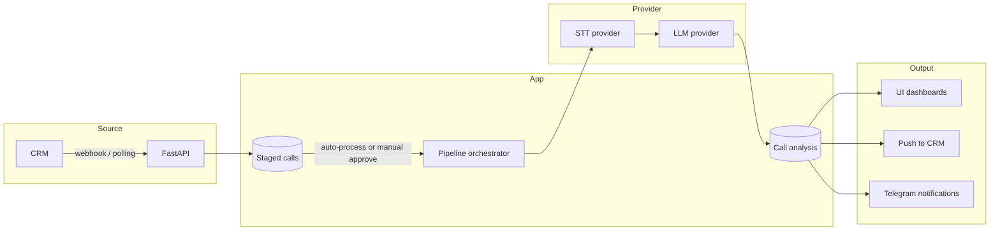

[Русский](./README.ru.md) · **English**

# Call Analytics System

An LLM service for analyzing phone conversations of sales and customer
service teams. Ingests calls from CRMs and returns a structured quality
score, detected patterns, and recommendations for operators.

> **Disclaimer.** This is a public architectural description of a real
> system the author worked on. Specific clients, domain names, financial
> indicators, source code, and proprietary implementation details are
> not disclosed. The content is limited to architectural decisions and
> principles publicly discussed for systems of this kind.

## What the system does

- **Call ingestion from CRMs**: webhook intake for push-capable CRMs
  (AmoCRM-style); polling for the rest.
- **Optional manual selection**: new calls first land in a staging
  queue; an operator/admin chooses which ones to process (or enables
  auto-process).
- **Transcription** with speaker diarization (operator / customer).
- **Semantic analysis** via LLM with a configurable prompt: scores per
  criteria (greeting, needs discovery, presentation, objection
  handling, closing, tone), detected patterns, recommendations.
- **Result push-back to CRM**: score, summary, link to report — into
  the deal/contact card.
- **Billing and analytics**: cost tracking per processing
  (LLM and STT spend via OpenRouter pricing), aggregates per project.

Delivery model — SaaS (multi-tenancy at the project level within an
installation). The architecture is also **on-premise ready**:
provider abstractions for STT/LLM allow switching to local models in
the customer's infrastructure, secrets are encrypted with Fernet
locally, no separate external dependencies. On-premise is relevant for
compliance-sensitive industries (healthcare, finance, government)
where audio must not leave the customer's perimeter.

## Business value

Sales and customer-service teams generate hundreds of phone
conversations a day. A manager can physically listen to maybe 1-3% of
them — the rest is a blind spot. Bad scripts go undetected, recurring
objections never surface, weak operators are flagged by KPI rather
than by what's actually wrong in their calls. Coaching ends up
anecdote-driven.

The system processes 100% of calls through STT, diarization, and
LLM-based scoring against the team's own quality rubric (greeting,
needs discovery, presentation, objection handling, closing, tone).
Score and summary go back into the CRM card; aggregates show which
objections come up most often, where each operator struggles, and
which scripts statistically don't work. AI presets are configurable
per team and per call category, so the same engine handles sales,
support, and complaints without code changes.

Net effect: continuous, objective quality oversight on every
conversation; structured input for coaching; and a feedback loop on
scripts and KPIs based on what calls actually look like, not what a
manager spot-checks.

## My role

Architect, developer, and product owner. End-to-end ownership by one
person:

- product decisions and MVP shaping
- system architecture and DB schema
- backend: API, pipeline orchestrator, CRM integrations, billing
- frontend: SPA, dashboards, AI-preset and project configuration pages
- testing, documentation, CI
- bare-metal deployment and operations

## Stack

| Layer | Technologies |
|---|---|
| **Backend** | Python 3.11, FastAPI, async SQLAlchemy 2.0, Alembic, Pydantic v2 |
| **Queues** | Celery + Redis |
| **DB** | PostgreSQL 15 |
| **Frontend** | React 19, TypeScript, Vite, TailwindCSS |
| **STT / LLM** | OpenAI-compatible providers via abstraction layer (AssemblyAI, OpenRouter, etc.); concrete set is configured in the AI-preset |
| **CRM integrations** | Adapter pattern with implementations per CRM (registry-based) |
| **Auth** | JWT (python-jose, HS256), bcrypt for passwords, RBAC (project_admin / project_viewer), rate-limit on login (slowapi), SSRF protection in adapters |
| **DB secret encryption** | Fernet (AES-256) at the application layer for sensitive fields |
| **Notifications** | Telegram (sync completion, low-score call alerts) |
| **CI** | GitLab CI |

## Call processing flow

A more detailed component diagram is in
[`docs/architecture.md`](docs/architecture.md).

## Processing steps

Processing of a single call is a sequence of steps inside one Celery
task, orchestrated by `PipelineOrchestrator`. Steps:

| # | Step | What it does |
|---|---|---|
| 1 | Ingestion | Intake from CRM (webhook or polling). Save to `staged_calls`. Deduplication by `(external_call_id, project_id)`. |
| 2 | Staging gate | If the project has `auto_process=True`, the call goes through; otherwise it waits for manual approval in the admin UI. |
| 3 | Preprocessing | Download audio by URL, normalize format. |
| 4 | STT | Transcription via the STT provider configured in the AI preset. |
| 5 | Diarization | If the STT provider doesn't return speakers — a separate diarization-provider call. |
| 6 | LLM Analysis | Scoring via the AI-preset prompt: criteria scores, patterns, recommendations. |
| 7 | Persist | Idempotent `INSERT ... ON CONFLICT (external_call_id, project_id) DO UPDATE` into `call_analysis`. |
| 8 | Push back | Result push to CRM (if a connector is configured) and Telegram notification (low score → separate channel). |

The Persist step's idempotence makes it safe to re-run processing on
any call — it doesn't duplicate, it updates.

## AI presets

In the admin UI, an admin creates **AI presets** — bundles of STT +
Diarization + LLM configs plus a prompt template. Presets are stored
in `system_config` as a **Fernet-encrypted JSON array**. Projects bind
to an active preset; multiple presets can be created and switched per
call category (e.g. sales and support — different criteria → different
prompts → different presets).

API responses mask keys (`****abcd`); the full text is visible only at
creation/edit time.

## Key architectural decisions

A detailed walkthrough is in [`docs/decisions.md`](docs/decisions.md).
Summary:

1. **Single Celery task with an orchestrator per call** — simpler
   recovery via idempotent upsert instead of a per-stage state machine.
2. **AI presets as encrypted JSON in `system_config`** — flexibility
   without normalization, keys are always encrypted.
3. **Staged table for manual selection** — control over the quality of
   processed calls.
4. **`Project.config_json` (JSONB) instead of normalized config tables**
   — fast config evolution without migrations.
5. **On-premise readiness via provider abstractions** — single codebase
   for SaaS and on-premise, switching by config.
6. **Webhook + polling in a single CRM interface** — one abstraction
   for different CRM types.

## What this project demonstrates

- **Architecture**: pipeline orchestration as a single Celery task
  with idempotent persist; provider abstraction for STT and LLM;
  Adapter pattern for CRMs with a registry; separation of config (JSONB)
  and domain data; single codebase for SaaS and on-premise.
- **Engineering**: production-grade Python async stack
  (FastAPI + async SQLAlchemy 2.0 + Celery), modern frontend
  (React 19 + TypeScript), bare-metal deploy; Fernet encryption, RBAC,
  rate-limit, SSRF protection.
- **Product**: end-to-end ownership from product idea to operations;
  UI-driven configurability without redeploy; integration with
  different CRMs without changes to the core.

## Additional documentation

- [`docs/architecture.md`](docs/architecture.md) — extended
  architectural description
- [`docs/decisions.md`](docs/decisions.md) — ADR-style walkthrough of
  key decisions
