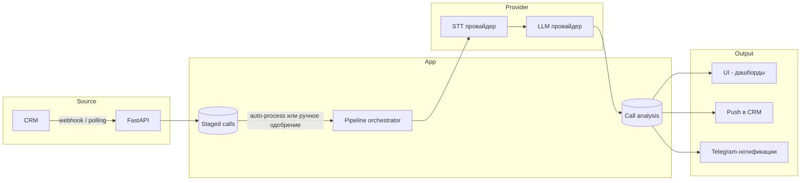

**Русский** · [English](./README.md)

# Call Analytics System

LLM-сервис для анализа телефонных разговоров отдела продаж и клиентского сервиса. Принимает звонки из CRM, на выходе — структурированная оценка качества разговора, выявленные паттерны, рекомендации операторам.

> **Дисклеймер.** Это публичное описание архитектуры реальной системы, в разработке которой автор участвовал. Конкретные клиенты, доменные имена, финансовые показатели, исходный код и проприетарные детали реализации не раскрываются. Содержание ограничено архитектурными решениями и принципами, обсуждаемыми в публичном поле для систем такого назначения.

## Что делает система

- **Получение звонков из CRM**: webhook-приём для CRM-систем, поддерживающих push (AmoCRM-подобные); polling для остальных.
- **Опциональный ручной отбор**: новые звонки сначала попадают в промежуточную очередь, оператор/админ выбирает, какие пускать в обработку (или включает auto-process).
- **Транскрипция** аудио с разделением спикеров (диаризация: оператор / клиент).
- **Семантический анализ** через LLM по настраиваемому промту: оценки по критериям (качество приветствия, выявление потребности, презентация, отработка возражений, закрытие, тон), выявленные паттерны, рекомендации.
- **Отдача результата обратно в CRM**: оценка, краткое содержание, ссылка на отчёт — в карточку сделки/контакта.
- **Биллинг и аналитика**: учёт стоимости каждой обработки (LLM- и STT-расходы по OpenRouter-pricing), агрегаты по проектам.

Поставка — SaaS (multi-tenancy на уровне проектов внутри инсталляции). Архитектура также **готова к on-premise**: провайдер-абстракции для STT/LLM позволяют переключиться на локальные модели в инфраструктуре клиента, секреты шифруются Fernet локально, отдельных внешних зависимостей нет. On-premise актуален для compliance-чувствительных отраслей (здравоохранение, финансы, государственный сектор), где аудио не должно покидать периметр клиента.

## Польза для бизнеса

Отделы продаж и клиентского сервиса генерируют сотни звонков в день. Руководитель физически способен прослушать 1-3% — остальное слепое пятно. Плохие скрипты не выявляются, повторяющиеся возражения не всплывают, слабые операторы видны только по KPI, а не по тому, что реально происходит у них в разговоре. Коучинг получается на анекдотах.

Система обрабатывает 100% звонков: транскрипция, диаризация спикеров, LLM-оценка по рубрике качества команды (приветствие, выявление потребности, презентация, отработка возражений, закрытие, тон). Оценка и резюме уходят обратно в карточку CRM; агрегаты показывают какие возражения встречаются чаще всего, на каких этапах проседает каждый оператор, какие скрипты статистически не работают. AI-пресеты конфигурируются под команду и под категорию звонков, поэтому один движок обслуживает продажи, поддержку и претензии без изменения кода.

Чистый эффект: непрерывный объективный контроль качества по каждому разговору; структурированный вход для коучинга операторов; обратная связь по скриптам и KPI на основе того, как звонки выглядят в реальности, а не выборочной проверки руководителем.

## Моя роль в проекте

Автор архитектуры, разработчик и продакт. Один человек end-to-end:

- продуктовое решение и формирование MVP
- архитектура системы и схема БД
- бэкенд: API, оркестратор пайплайна, интеграции с CRM, биллинг
- фронтенд: SPA, дашборды, страницы настройки AI-пресетов и проектов
- тестирование, документирование, CI
- деплой и эксплуатация на bare-metal

## Стек

| Слой | Технологии |
|---|---|
| **Backend** | Python 3.11, FastAPI, async SQLAlchemy 2.0, Alembic, Pydantic v2 |
| **Очереди** | Celery + Redis |
| **БД** | PostgreSQL 15 |
| **Frontend** | React 19, TypeScript, Vite, TailwindCSS |
| **STT / LLM** | OpenAI-совместимые провайдеры через провайдер-абстракцию (AssemblyAI, OpenRouter и др.); конкретный набор задаётся в AI-пресете |
| **Интеграции CRM** | Adapter-паттерн с реализациями под разные CRM (registry-based) |
| **Авторизация** | JWT (python-jose, HS256), bcrypt для паролей, RBAC (project_admin / project_viewer), rate-limit на логине (slowapi), SSRF-защита в адаптерах |
| **Шифрование секретов в БД** | Fernet (AES-256) на уровне приложения для чувствительных полей |
| **Notifications** | Telegram (нотификации о завершении синхронизации, о звонках с низкой оценкой) |
| **CI** | GitLab CI |

## Поток обработки звонка

Подробная компонентная диаграмма — в [`docs/architecture.ru.md`](docs/architecture.ru.md).

## Шаги обработки

Обработка одного звонка — это последовательность шагов внутри одной Celery-задачи, оркестрируемая `PipelineOrchestrator`. Шаги:

| # | Шаг | Что делает |
|---|---|---|
| 1 | Ingestion | Приём из CRM (webhook или polling). Сохранение в `staged_calls`. Дедупликация по `(external_call_id, project_id)`. |
| 2 | Staging gate | Если у проекта `auto_process=True` — звонок сразу идёт дальше; иначе ждёт ручного одобрения в админке. |
| 3 | Preprocessing | Скачивание аудио по URL, нормализация формата. |
| 4 | STT | Транскрипция через выбранный в AI-пресете STT-провайдер. |
| 5 | Diarization | Если STT-провайдер не возвращает спикеров — отдельный вызов diarization-провайдера. |
| 6 | LLM Analysis | Оценка по промту из AI-пресета: оценки по критериям, паттерны, рекомендации. |
| 7 | Persist | Идемпотентный `INSERT ... ON CONFLICT (external_call_id, project_id) DO UPDATE` в `call_analysis`. |
| 8 | Push back | Отдача результата в CRM (если коннектор настроен) и нотификация в Telegram (низкая оценка → отдельный канал). |

Идемпотентность Persist-шага позволяет безопасно перезапустить обработку любого звонка — не дублирует, обновляет.

## AI-пресеты

В UI админ создаёт **AI-пресеты** — наборы из STT + Diarization + LLM конфигов и промт-шаблона. Пресеты хранятся в `system_config` как **зашифрованный (Fernet) JSON-массив**. К проекту привязывается активный пресет; можно создавать несколько пресетов и переключать под разные категории звонков (например, продажи и поддержка — разные критерии оценки → разные промты → разные пресеты).

В ответах API ключи маскируются (`****abcd`); полный текст видим только в момент создания / редактирования.

## Ключевые архитектурные решения

Подробный разбор — в [`docs/decisions.ru.md`](docs/decisions.ru.md). Краткий список:

1. **Обработка звонка — одна Celery-задача с оркестратором** — простота восстановления через идемпотентный upsert вместо per-stage state machine.
2. **AI-пресеты как зашифрованный JSON в `system_config`** — гибкость без нормализации, ключи всегда шифруются.
3. **Staged-таблица для ручного отбора** — управляемость качеством обрабатываемых звонков.
4. **Project.config_json (JSONB) вместо нормализованных таблиц настроек** — быстрая эволюция конфига без миграций.
5. **Готовность к on-premise через провайдер-абстракции** — единая кодовая база под SaaS и on-premise, переключение конфигом.
6. **Webhook + polling в одном CRM-интерфейсе** — единая абстракция для разных типов CRM.

## Что демонстрирует этот проект

- **Архитектурно**: оркестрация пайплайна через единую Celery-задачу с идемпотентным persist; provider-абстракция для STT и LLM; Adapter-паттерн для CRM с registry; разделение config (JSONB) и доменных данных; единая кодовая база под SaaS и on-premise.
- **Технически**: Python async-стек продакшен-уровня (FastAPI + async SQLAlchemy 2.0 + Celery), современный фронт (React 19 + TypeScript), bare-metal-деплой; Fernet-шифрование, RBAC, rate-limit, SSRF-защита.
- **Продуктово**: end-to-end ownership от продуктовой идеи до эксплуатации; конфигурируемость через UI без редеплоя; интеграция с разными CRM без изменения core.

## Дополнительная документация

- [`docs/architecture.ru.md`](docs/architecture.ru.md) — расширенное архитектурное описание
- [`docs/decisions.ru.md`](docs/decisions.ru.md) — ADR-style разбор ключевых решений

