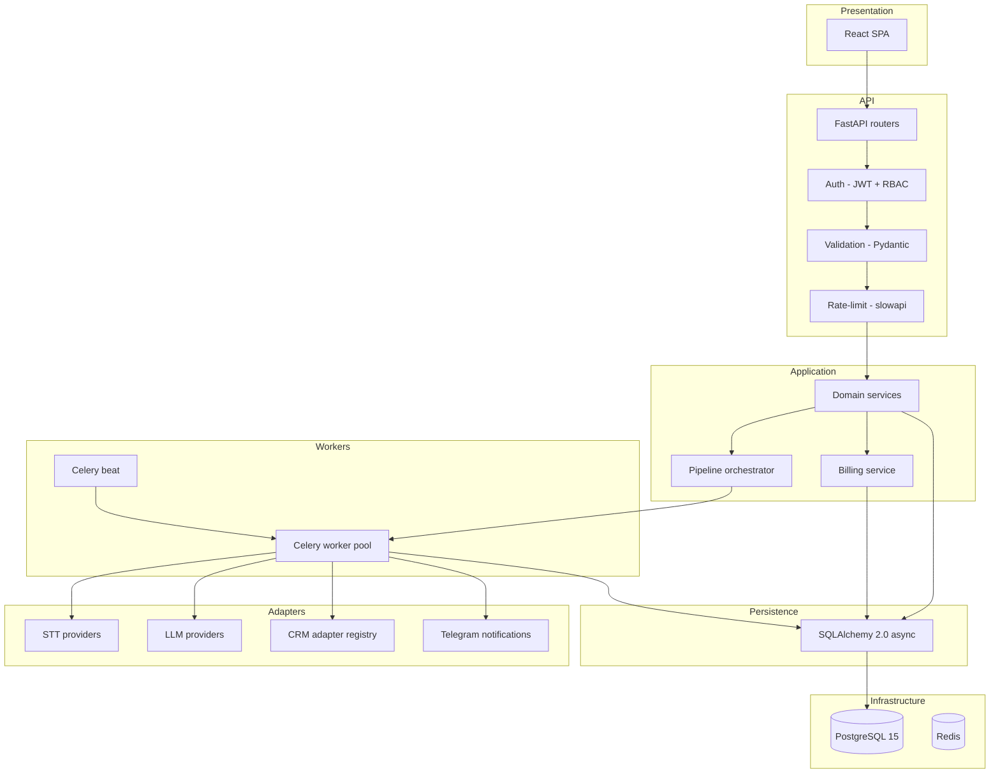
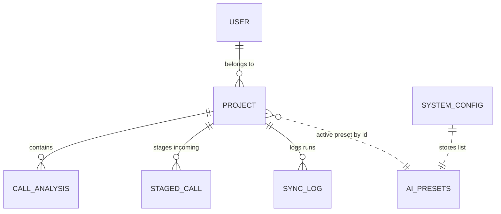
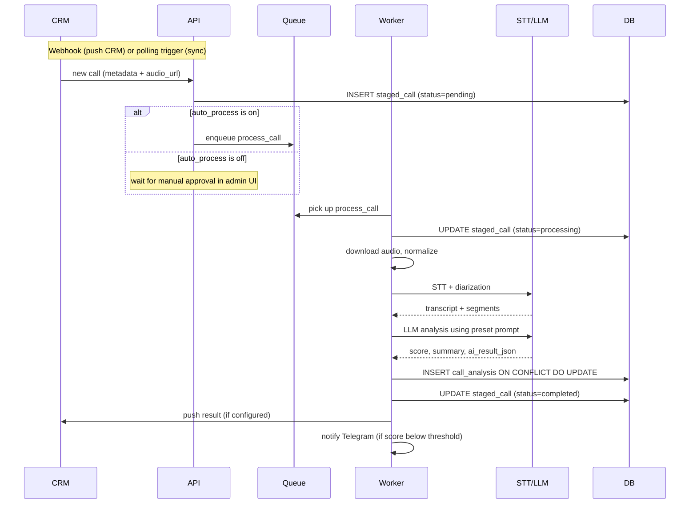
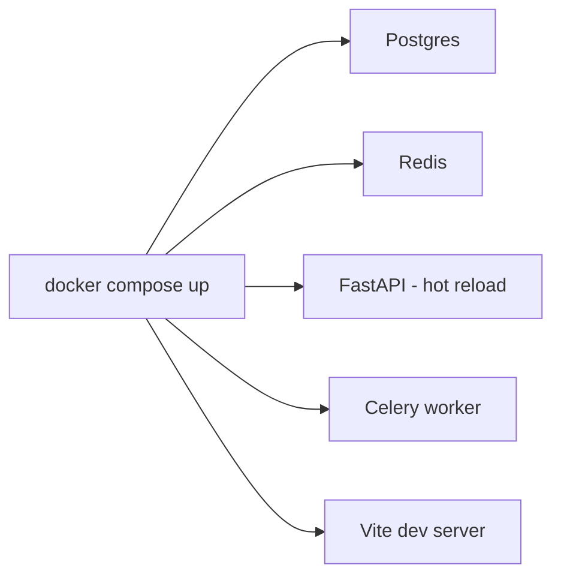
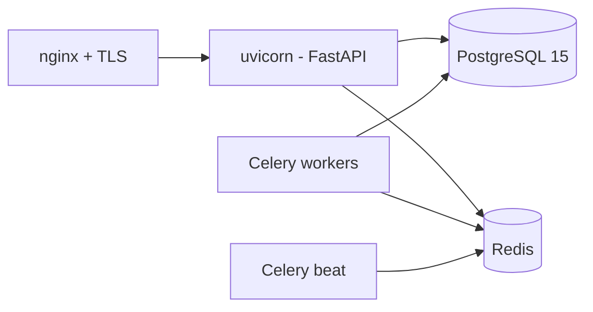

[Русский](./architecture.ru.md) · **English**

# Architecture — Call Analytics System

> **Disclaimer.** This is a public architectural description of a real
> system the author worked on. Specific clients, domain names,
> financial indicators, source code, and proprietary implementation
> details are not disclosed. The content is limited to architectural
> decisions and principles publicly discussed for systems of this kind.

Extended architectural description. Companion to [README.md](../README.md).

## 1. System layers

### Separation principles

- **Presentation** doesn't know about the DB or the domain logic;
  communicates with the API exclusively over REST.
- **API** validates, authorizes, rate-limits, and forwards data to
  **Application**. No business logic in routers.
- **Application** — domain services, pipeline orchestrator, billing.
  Doesn't know about HTTP or specific providers.
- **Workers** — async execution of long tasks (call processing,
  CRM sync). Receive data via queues, not HTTP.
- **Adapters** — the only point of contact with the outside world
  (STT/LLM providers, CRM, Telegram). Swapping implementations doesn't
  affect Application.
- **Persistence** — async SQLAlchemy with a repository-style data
  access.

## 2. Domain model

### Entity purposes

- **USER** — user account with a role (`project_admin` /
  `project_viewer`) and a project binding.
- **PROJECT** — an isolated working context. The key field is
  `config_json` (JSONB) holding CRMConnectionConfig, AIConfig (a
  reference to the active preset), PromptConfig, AccessControlConfig,
  TelegramConfig. JSONB was chosen for fast config evolution without
  migrations.
- **STAGED_CALL** — staging queue of calls from CRM awaiting manual
  approval (or auto-process passes them straight through).
- **CALL_ANALYSIS** — the final record for a processed call: call
  metadata, transcript (`transcript_text` + `transcript_segments`
  JSON), score (`score`), summary (`summary`), full result JSON
  (`ai_result_json`), status (`pending` / `processing` / `completed` /
  `failed`). Uniqueness on `(external_call_id, project_id)` ensures
  idempotence.
- **SYNC_LOG** — a journal of CRM sync runs (status, time, number of
  found / processed / failed calls).
- **SYSTEM_CONFIG** — global settings as key/value pairs. The
  `ai_presets` key holds a Fernet-encrypted JSON array of presets;
  `proxy` holds proxy settings, etc.

### Denormalization and JSONB

The transcript and analysis are stored in a single `call_analysis`
table (fields `transcript_text`, `transcript_segments`, `score`,
`summary`, `ai_result_json`): one call = one result. UI queries and
CRM push work with a single row.

`Project.config_json` (JSONB) holds CRMConnectionConfig, AIConfig,
PromptConfig, AccessControlConfig, TelegramConfig as a nested
structure. Validation is via Pydantic on read and write. Changes to
the config are journaled in the audit log.

## 3. Call lifecycle

## 4. Recovery semantics

Recovery is built on **idempotence at the result-write level**:

- `INSERT` into `call_analysis` uses
  `ON CONFLICT (external_call_id, project_id) DO UPDATE`. Any rerun
  of processing for the same call overwrites the result without
  creating a duplicate.
- If a worker crashes mid-processing, `staged_call` stays in
  `processing` or `pending`. A separate auto-recovery task (Celery
  beat) detects «stuck» records and returns them to the queue.
- Failed calls are visible in the UI; an admin can manually re-run —
  this is idempotent and safe.
- `SyncLog` aggregates sync state: if the sync failed, you can see
  where and how many calls made it through.

## 5. Security

### Authentication and authorization

- **JWT (HS256)** via `python-jose`. Short-lived access token,
  refresh token in an HttpOnly cookie.
- **bcrypt** for password storage.
- **RBAC** at the role level: `project_admin` (full rights in the
  project) / `project_viewer` (read-only). Each user is bound to one
  project.
- **Rate-limit** on sensitive endpoints (login, registration, password
  reset) via `slowapi`.
- **SSRF protection** in CRM adapters: target URL validation before
  outbound requests to prevent reaching internal networks.

### Sensitive data encryption

- **Fernet (AES-256)** for encrypting DB fields containing API keys
  and tokens: STT/LLM provider keys in AI presets, OAuth tokens and
  API secrets for CRM integrations, proxy credentials.
- The encryption key is stored in env, not in the DB.
- DB backups, dumps, and DB administration tools see only ciphertext.

### Audit log

A separate table records user actions on key entities:
authentication, project config changes, manual operations on staged
calls, AI-preset switches. The set is extended as new compliance
requirements emerge.

## 6. Deployment

### Dev — Docker Compose

A single command starts the entire stack. Hot-reload for backend and
frontend.

### Production

The target installation is a single-server Linux (Ubuntu LTS).
Backend runs under uvicorn workers behind a reverse proxy (nginx) with
TLS termination; Celery workers and the beat scheduler are separate
processes; everything is managed by a process supervisor (systemd
units). The frontend static bundle is served by nginx.

Release rollout: `git pull` in the working directory,
`pip install -r requirements.txt` (if dependencies changed), DB
migrations via Alembic, `systemctl restart` of the affected services.

### CI

GitLab CI with stages:

1. **Lint** — static code checks
2. **Test** — pytest unit + integration (with PostgreSQL and Redis
   running in the CI runner)
3. **Build** — frontend bundle, backend artifact
4. **Artifact** — packaged release

## 7. Monitoring and observability

- **Structured logs** in JSON via python-logging, with the log
  aggregator on the installation side.
- **Health endpoints** in the API: `/health` (liveness),
  `/health/deps` (readiness — DB, Redis check).
- **Metrics**: number of calls by status in `call_analysis`; call
  processing time; error rate by STT/LLM provider; billing spend per
  project.
- **Telegram notifications**: sync completion, low-score calls.
- **Auto-recovery** via Celery beat: detection of «stuck» records and
  return to the queue.
