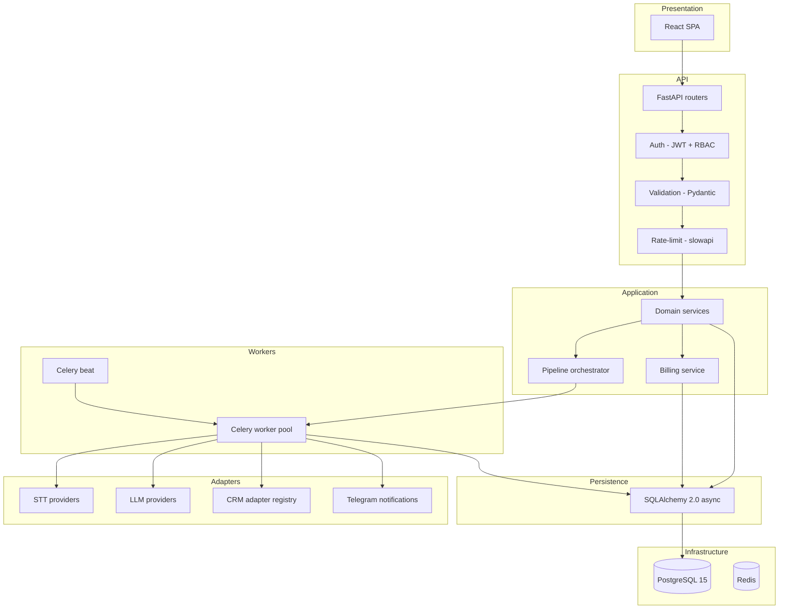
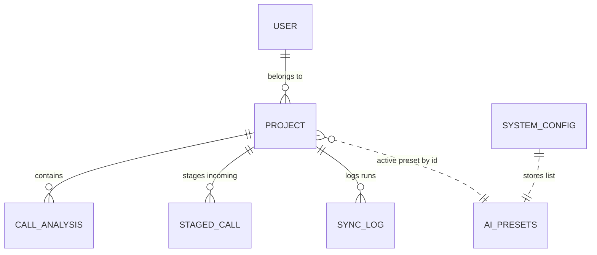
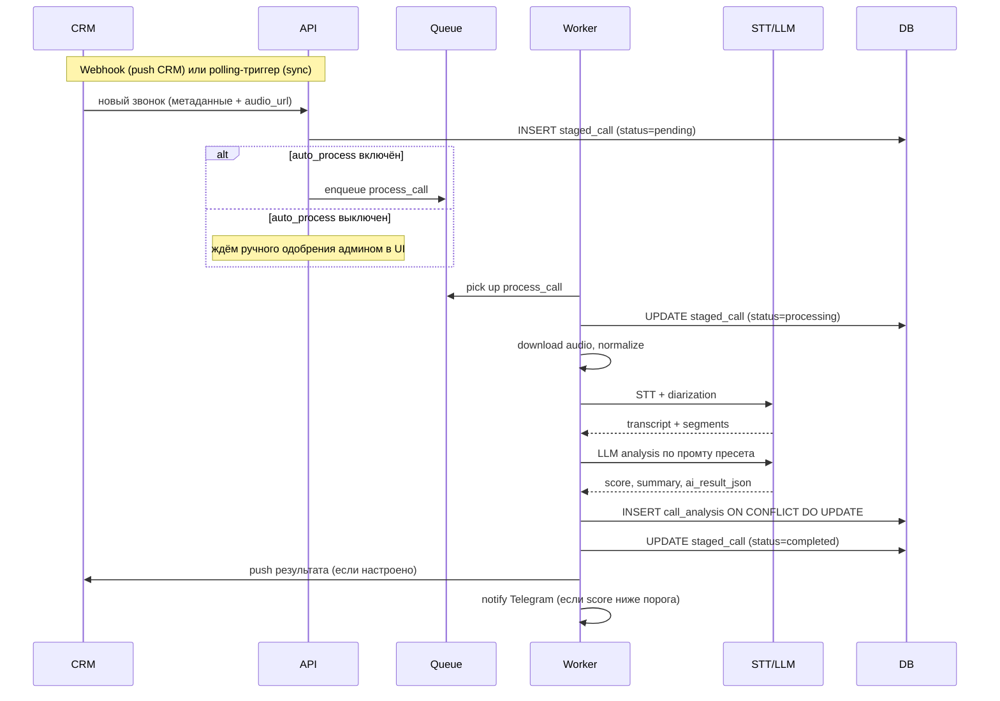
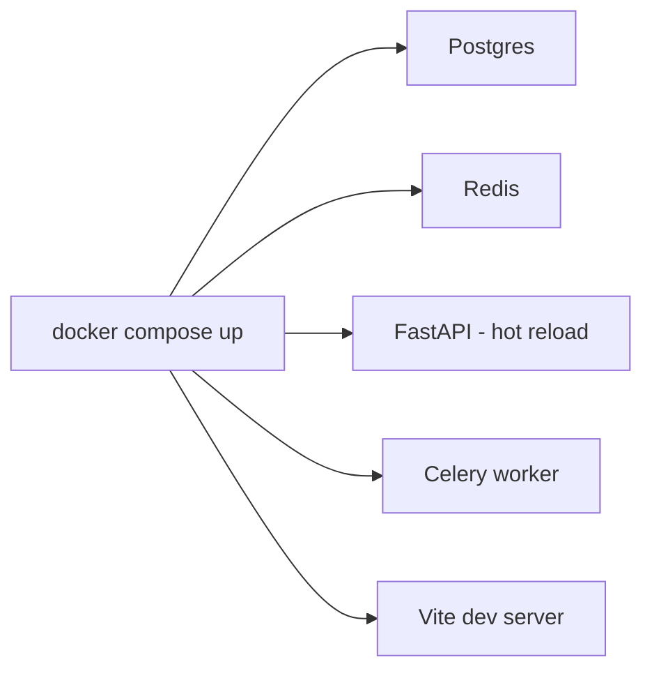
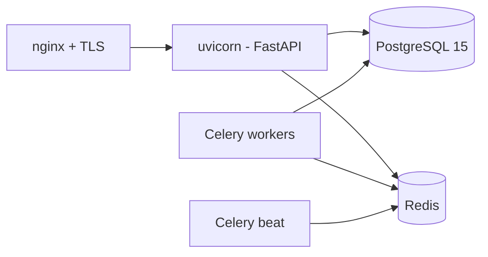

**Русский** · [English](./architecture.md)

# Architecture — Call Analytics System

> **Дисклеймер.** Это публичное описание архитектуры реальной системы, в разработке которой автор участвовал. Конкретные клиенты, доменные имена, финансовые показатели, исходный код и проприетарные детали реализации не раскрываются. Содержание ограничено архитектурными решениями и принципами, обсуждаемыми в публичном поле для систем такого назначения.

Расширенное архитектурное описание. Дополняет [README.md](../README.md).

## 1. Слои системы

### Принципы разделения

- **Presentation** не знает о БД и доменной логике, общается с API исключительно через REST.
- **API** валидирует, авторизует, ограничивает rate, передаёт данные в **Application**. Без бизнес-логики в роутерах.
- **Application** — доменные сервисы, оркестратор пайплайна, биллинг. Не знает о HTTP и о конкретных провайдерах.
- **Workers** — асинхронное выполнение длинных задач (обработка звонка, синхронизация с CRM). Получают данные через очереди, не через HTTP.
- **Adapters** — единственная точка контакта с внешним миром (STT/LLM-провайдеры, CRM, Telegram). Замена реализации не трогает Application.
- **Persistence** — async SQLAlchemy с repository-стилем доступа.

## 2. Доменная модель

### Назначение сущностей

- **USER** — учётка пользователя с ролью (`project_admin` / `project_viewer`) и привязкой к проекту.
- **PROJECT** — изолированный контекст работы. Ключевое поле — `config_json` (JSONB) с CRMConnectionConfig, AIConfig (ссылка на активный пресет), PromptConfig, AccessControlConfig, TelegramConfig. JSONB выбран для быстрой эволюции конфига без миграций.
- **STAGED_CALL** — промежуточная очередь звонков из CRM, ожидающих ручного одобрения (или auto-process сразу пропускает их дальше).
- **CALL_ANALYSIS** — итоговая запись по обработанному звонку: метаданные звонка, транскрипт (`transcript_text` + `transcript_segments` JSON), оценка (`score`), краткое содержание (`summary`), полный JSON результата (`ai_result_json`), статус (`pending` / `processing` / `completed` / `failed`). Уникальность по `(external_call_id, project_id)` — обеспечивает идемпотентность.
- **SYNC_LOG** — журнал запусков синхронизации с CRM (статус, время, число найденных/обработанных/упавших звонков).
- **SYSTEM_CONFIG** — глобальные настройки в формате key/value. Ключ `ai_presets` хранит зашифрованный (Fernet) JSON-массив пресетов; ключ `proxy` — настройки прокси и т.п.

### Денормализация и JSONB

Транскрипт и анализ хранятся в одной таблице `call_analysis` (поля `transcript_text`, `transcript_segments`, `score`, `summary`, `ai_result_json`): один звонок = один результат. Запросы к UI и push в CRM работают с одной строкой.

`Project.config_json` (JSONB) хранит CRMConnectionConfig, AIConfig, PromptConfig, AccessControlConfig, TelegramConfig в виде вложенной структуры. Валидация — через Pydantic при чтении и записи. Изменения в конфиге журналируются в audit log.

## 3. Жизненный цикл звонка

## 4. Recovery semantics

Recovery — через **идемпотентность на уровне записи результата**:

- INSERT в `call_analysis` использует `ON CONFLICT (external_call_id, project_id) DO UPDATE`. Любой повторный запуск обработки того же звонка перезапишет результат, не создаст дубль.
- Если worker упал в середине обработки — `staged_call` остаётся в `processing` или `pending`. Отдельный auto-recovery-таск (Celery beat) детектит «застрявшие» записи и возвращает их в очередь.
- Failed-звонки видны в UI; админ может вручную перезапустить — это идемпотентно и безопасно.
- `SyncLog` агрегирует состояние синхронизации: если синхронизация упала, видно в каком месте и сколько звонков успело пройти.

## 5. Безопасность

### Аутентификация и авторизация

- **JWT (HS256)** через `python-jose`. Access-токен короткоживущий, refresh-токен в HttpOnly cookie.
- **bcrypt** для хранения паролей.
- **RBAC** на уровне роли: `project_admin` (полные права в проекте) / `project_viewer` (только чтение). Каждый пользователь привязан к одному проекту.
- **Rate-limit** на чувствительных endpoint'ах (логин, регистрация, password reset) через `slowapi`.
- **SSRF-защита** в CRM-адаптерах: проверка целевых URL перед outbound-запросами, чтобы исключить попадание во внутренние сети.

### Шифрование чувствительных данных

- **Fernet (AES-256)** для шифрования полей в БД, содержащих API-ключи и токены: ключи STT/LLM-провайдеров в AI-пресетах, OAuth-токены и API-секреты CRM-интеграций, прокси-credentials.
- Encryption key хранится в env, не в БД.
- Бэкап БД, дампы и инструменты администрирования БД видят только шифр.

### Audit log

В отдельной таблице фиксируются пользовательские действия с ключевыми сущностями: аутентификация, изменение конфигурации проекта, ручные операции над staged-звонками, переключение AI-пресетов. Состав расширяется по мере появления новых требований compliance.

## 6. Деплой

### Dev — Docker Compose

Одна команда для старта всего стека. Hot-reload для бэкенда и фронта.

### Production

Целевая инсталляция — single-server Linux (Ubuntu LTS). Backend под uvicorn-воркерами за reverse-proxy (nginx) с TLS-терминацией; Celery-воркеры и beat-планировщик — отдельные процессы; всё под управлением process-supervisor (systemd-units). Static-bundle фронтенда раздаётся nginx'ом.

Раскатка релиза — `git pull` в рабочей директории, `pip install -r requirements.txt` (если зависимости менялись), миграции БД через Alembic, `systemctl restart` нужных служб.

### CI

GitLab CI с этапами:

1. **Lint** — статические проверки кода
2. **Test** — pytest unit + integration (с поднятой PostgreSQL и Redis в CI-runner)
3. **Build** — frontend bundle, backend артефакт
4. **Artifact** — упакованный релиз

## 7. Мониторинг и observability

- **Структурированные логи** в JSON через python-logging, агрегатор журналов на стороне инсталляции.
- **Health endpoints** в API: `/health` (liveness), `/health/deps` (readiness — проверка БД, Redis).
- **Метрики**: количество звонков по статусам в `call_analysis`; время обработки звонка; error rate по STT/LLM-провайдерам; биллинг-расходы по проектам.
- **Telegram-нотификации**: завершение синхронизации, звонки с низкой оценкой.
- **Auto-recovery** через Celery beat: проверка «застрявших» записей и возврат их в очередь.

